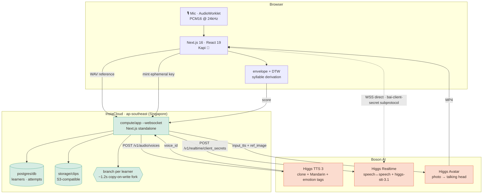

<div align="center">

# Mother Tongue 母语

### You'll never sound like a native speaker. You can sound like yourself.

**Live:** https://prod-main-app-72ab6b-20xs7r50raw.compute.instacloud-edge.com

</div>

---

## What this is

Mother Tongue clones your voice from fifteen seconds of English, then plays that
same voice back to you speaking fluent Mandarin. You practise against
**yourself** — a recording of your own voice saying the thing you've never been
able to say — and the app scores how closely your rhythm matches it. Then it puts
you on a first date, in Mandarin, with someone who teases you when you fumble.

## The problem

About **3.4 million** US residents speak Chinese at home (US Census / ACS). A
large share of the generation raised in those households are *heritage
speakers*: they grew up hearing the language, understand it, and still can't
speak it. They are not beginners. They're stuck on something else: **shame**.
Every app hands them a flawless native speaker to imitate, which quietly confirms
the thing they already believe — *I will never sound like that.* So they don't
open their mouth, and the one sentence they can say fluently is
对不起，我的中文不好 — "sorry, my Chinese isn't good."

### Our solution

Make the model **their own voice**.

Self-modelling is established practice in speech therapy: a target you perceive
as attainable is one you actually move toward. Until zero-shot voice cloning and
102-language synthesis lived in the same model, you could not build this. Now you
can, in one API call.

Two design consequences fall out of that:

1. **We score rhythm, not phonemes.** What marks a heritage speaker isn't
   individual sounds — it's stress and timing. So we compare energy envelopes,
   not vowels (see [How the scoring works](#how-the-scoring-works)).
2. **We never correct you mid-conversation.** 小雨 reacts to what you *meant*,
   the way a real date would. Fluency is built by being understood, not by being
   graded.

## The five minutes

| Step | What happens |
|---|---|
| **1 · Clone** | Read one English sentence aloud. → a reusable `voice_<id>`. |
| **2 · The Mirror** | That voice says 我在学我家的语言。这是我的声音。 This is the moment. |
| **3 · Practice** | Hear the phrase in your own voice, say it back, get scored on **rhythm**. |
| **4 · Scenarios** | Live Mandarin: ordering coffee, a first date (撩), meeting her parents. |
| **5 · Finale** | A photo + a sentence → a talking-head video of you saying it to someone. |

---

## How we use each sponsor

| Sponsor | Product | What it does here | Code |
|---|---|---|---|
| **Boson AI** | Higgs TTS 3 | Zero-shot voice clone; the same voice then speaks Mandarin with inline emotion tags | `src/lib/boson.ts` |
| **Boson AI** | Higgs Realtime | Full-duplex Mandarin conversation with barge-in and tool calling — **and** all speech-to-text | `src/lib/realtime.ts` |
| **Boson AI** | Higgs Avatar | Photo + cloned voice → talking-head MP4 for the closing message | `src/app/api/avatar/route.ts` |
| **InstaCloud** | Branching | **One branch per learner**, forked at runtime in ~1.2s — isolates each voiceprint | `src/lib/insta.ts` |
| **InstaCloud** | Compute | The app itself, microVM, deployed `--websocket`, Singapore | `Dockerfile` |
| **InstaCloud** | Postgres | Learners, attempts, per-syllable scores | `src/lib/db.ts` |
| **InstaCloud** | Storage | S3-compatible bucket for generated clips | `scripts/insta-setup.sh` |

### Boson AI

The whole product is three Higgs APIs in a chain, and each one is doing something
only it can do.

- **Higgs TTS 3** does the thing the pitch rests on: it clones a voice from
  English reference audio and then speaks **Mandarin** in it. Cross-lingual
  cloning from a single 15-second sample is what makes "hear yourself" possible.
  We drive delivery with inline tags — `<|emotion:longing|>` on 奶奶，我很想你,
  `<|emotion:shame|><|sfx:sigh|>` on 对不起，我的中文不好 — so the phrase carries
  the feeling it actually has.
- **Higgs Realtime** runs the scenarios: `semantic_vad` turn detection, barge-in,
  and a `learner_is_struggling` tool the model calls when you stall, so Kapi can
  step in with a hint. It is also, less obviously, our **entire STT layer** —
  `higgs-stt-3.1` has no standalone endpoint, so scoring opens a short
  manual-turn WebSocket purely to transcribe an attempt.
- **Higgs Avatar** renders the finale: your photo, your cloned voice, Mandarin,
  ~10 seconds to a 480×640 MP4 you can actually send to your grandmother.

### InstaCloud

The standout primitive is **branching** — a branch clones the Postgres data, the
bucket, and every compute service in about a second. We made that the product,
not the deployment story:

> **Every learner gets their own branch, forked at runtime.** Your cloned
> voiceprint never shares a table with anyone else's, and cleanup is one
> `insta branch delete`.

A voiceprint is biometric data. Branch-per-learner turns InstaCloud's crown jewel
into a **privacy property** rather than a convenience — measured at ~1.2s per
fork, which is fast enough to sit inside the signup path. The infra panel in the
app's top-right reads the live branch list, so you can watch a fork appear as
someone starts.

Underneath that: Postgres for attempt history, an S3-compatible bucket for clips,
and compute deployed with `--websocket`. Everything is pinned to **`ap-southeast`
(Singapore)** — region is fixed at service-creation time, so `insta-setup.sh`
sets it before anything else exists.

---

## Architecture



Two decisions worth calling out:

- **The browser talks to Boson directly.** Our server mints a short-lived
  ephemeral key; the browser passes it as a WebSocket subprotocol
  (`bai-client-secret.<key>`). No audio proxy, no relay latency, and the real API
  key never leaves the server.
- **Scoring runs client-side.** Envelopes and DTW are pure TypeScript on samples
  the browser already has, so the round trip carries ~200 floats instead of audio.

## How the scoring works

Boson has **no pronunciation-scoring endpoint**, so we don't pretend to score
phonemes. We score the thing that actually makes a heritage speaker sound
foreign: **rhythm and stress**.

1. Synthesise the target in the learner's cloned voice.
2. Take an RMS **energy envelope** of both the target and the attempt.
3. Align them with **DTW**, and walk the warping path back so every target
   syllable knows where it landed in the learner's timeline.
4. Score = words landed (45%) + rhythm (35%) + pace (20%).

The visual is the point: target on top, your attempt mirrored underneath, drifted
characters highlighted. `src/lib/score.ts`.

---

## What the live API actually does (vs. the docs)

Everything below was found by running against the real endpoints.

- **`timestamps` always returns `null`.** The docs advertise word-level
  timestamps for English, Chinese and Spanish. The field is accepted and the
  response envelope changes shape, but the value is `null` — every language,
  every length, including the docs' own `"The quick brown fox…"` example.
  So `deriveStamps()` recovers per-character windows from the audio instead:
  Mandarin is syllable-timed and one hanzi is one syllable, so we cut the voiced
  span at the N-1 deepest well-separated energy valleys. Verified at 11
  characters → 11 syllables, 0.24s mean. Arguably better than the API feature,
  since it measures the audio that actually got generated.
- **Voice cloning returns `voice_id`**, not `voice` or `id` as the docs samples
  show. Reading the documented field fails every clone.
- **There is no standalone STT endpoint** — `higgs-stt-3.1` exists only inside a
  Realtime session. Quality is excellent (exact, character-for-character on a
  2.8s Mandarin clip) but it needs ~2s of audio; sub-second clips come back as
  nonsense in the wrong language.
- **Rate limits are tight enough to hit by hand**, and a 429 mid-demo looks
  exactly like a broken app, so every call retries with backoff.
- TTS degrades past ~300 characters and returns garbled audio as a *200*, not an
  error. `chunkForTts()` splits on CJK sentence boundaries.
- Reference audio for cloning must be **≥ 3 seconds**; the UI asks for 15.

CLI notes (against `insta` 0.1.0, which differs from the docs): the regions
command is **`insta config regions`** and Singapore is **`ap-southeast`**; there
is no `insta manifest`, so the infra panel composes its view from
`status`/`services list`/`branch list --json`; `branch delete` takes no
confirmation flag; and on Windows the global CLI is a `.CMD` shim that Node's
`execFile` cannot resolve, so set `INSTA_BIN`.

> If you send Chinese through `curl -d` from Git Bash on Windows it arrives as
> mojibake and the model generates ~¼-length garbage audio at a 200. Send the
> body as a UTF-8 file. This cost an hour.

## Keeping the tooling contained

`insta project create` / `project link` have side effects well outside what the
command name suggests, with no opt-out flag. On a first run they install **24
vendor `SKILL.md` files** into `.claude/skills/`, `.agents/skills/` and
`.github/skills/`, add a **`PostToolUse` hook** that executes
`.insta/observe/hook.js` after every agent tool call, and write the **account
token** to `~/.insta/config.json` outside the repo.

For the record, that hook was audited and is **local-only**: it scans tool-use
events for credential exposure and appends findings to `.insta/audit.jsonl`.
There is no `fetch`, no HTTP client and no URL anywhere in it, so nothing is
transmitted. (`insta agent observe report` reads that file separately — don't run
it if the log may hold anything sensitive.)

None of it is wanted here, so `.gitignore` excludes `.insta/`, `.claude/`,
`.codex/`, `.agents/`, `.github/skills/` and `skills-lock.json` wholesale, and
`scripts/insta-setup.sh` runs the CLI through **`pnpm dlx`** (never installed
globally), redirects `HOME` into a repo-local `.insta-home/`, and **scrubs** the
injected files after every call. Revoke with `rm -rf .insta-home`.

## Run it

```bash
pnpm install
cp .env.example .env    # optional — it runs without keys
pnpm dev
```

**With no keys it still runs end to end** on synthesised tones, so the whole flow
is clickable. Add `BOSON_API_KEY` and it becomes real.

```bash
pnpm build && pnpm start    # production (standalone server)
```

## Deploy

```bash
export BOSON_API_KEY=bai-...
export INSTA_API_KEY=insta_...
./scripts/insta-setup.sh
```

Provisions Postgres + a public bucket + compute in Singapore, binds
`DATABASE_URL`, stores the secrets, and deploys with `--websocket`.

## Stack

Next.js 16 · React 19 · Tailwind 4 · TypeScript 5.9 · motion · postgres · zustand

TypeScript is pinned to 5.9 and ESLint to 9.x deliberately: `typescript-eslint`
does not support TS 7, and `eslint-plugin-react` breaks on ESLint 10. Everything
else is current.

```
src/lib/boson.ts      Boson client: voices, speech, client secrets, avatar
src/lib/realtime.ts   Browser WebSocket: conversation + transcribe-once
src/lib/score.ts      Energy envelopes, DTW alignment, syllable derivation
src/lib/audio.ts      Capture, WAV encoding, PCM16, gapless playback
src/lib/insta.ts      Branch-per-learner over the insta CLI
src/lib/content.ts    The Mandarin. Read this one first.
src/components/Kapi.tsx  The capybara
```

## Consent

Voice cloning requires the right to the voice. The app only ever clones the
person sitting in front of it, from a script they read aloud themselves.
